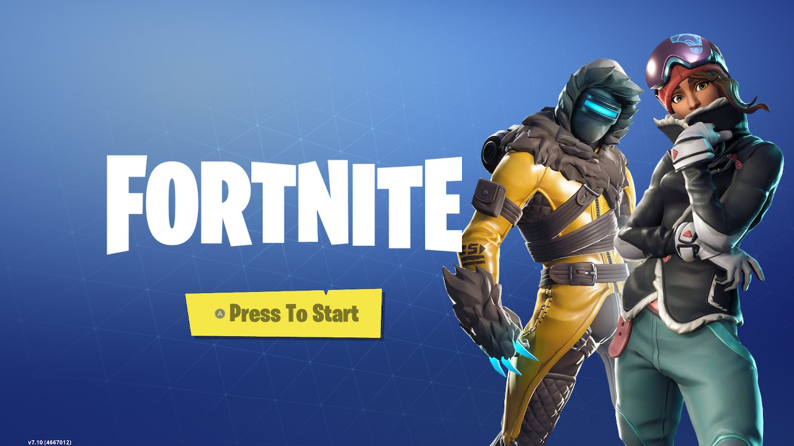

Y'all, I'm not a gamer.

Until recently, my gaming habits have involved loading up GTAV on my PS3 (which feels _ancient_ now) and farting around, crashing cars and angering police. Or playing NCAA Football 2014 ([RIP](https://www.sbnation.com/college-football/2018/7/9/17434068/ncaa-football-ea-sports-video-game-return)) on Freshman mode and running Hail Mary plays the whole game.

That all changed when I got a Nintendo Switch for my birthday.

And more specifically, it changed when I downloaded [Fortnite](https://www.epicgames.com/fortnite/en-US/buy-now/battle-royale) for free on the Switch.

I have to admit: I really enjoy it sometimes. Though, not all the time — _we'll get to that later_.

## What is Fortnite?

When people say "Fortnite," they're probably referring to the Battle Royale mode of a popular release by Epic Games. The Battle Royle mode specifically is free-to-play (known as _F2P_ in the biz), while there are campaign modes of Fortnite that cost money.

The wild part about Fortnite is that you can play it pretty much anywhere: PC, PlayStation 4, Xbox One, Nintendo Switch, Android, iOS & Mac. Yes, you read that right: **Android, iOS AND Mac** are included in that list. Talk about growing an audience!

The game is a global phenomenon, likely due to the fact that it is free-to-play, available on a ton of platforms, has a [huge streamer following](https://www.polygon.com/2018/3/5/17078646/ninja-fortnite-twitch-stream-subscribers)... and did I mention that it's free?

I'd also bet that it's so popular because it is stylized, non-violent (to a certain degree, e.g. no blood or terms like "kills"). Epic Games is also releasing big changes and improvements to the game in the form of "Seasons" (we're currently on Season 7 right now) and frequent content updates and patches.

Because of this, Epic Games is [making](https://www.recode.net/2018/6/26/17502072/fortnite-revenue-game-growth-318-million) [bank](https://techcrunch.com/2018/12/27/epic-fortnite-3-billion-profit/). Even though this mode is free, there are a ton of micro-transactions to purchase season passes (extra challenges and rewards), emotes (dance moves), skins and outfits. And these don't offer a competitive advantage during gameplay — they're cosmetic-only!

## How to do a Fortnite

Go to a lobby area with other people
Dance if you want

Get on a bus
Jump out of the bus

Loot
Fight people
Die (a lot)

## How I like to play

One word: challenges!

## Do you need to pay?

No

## Bonus: Who to watch

