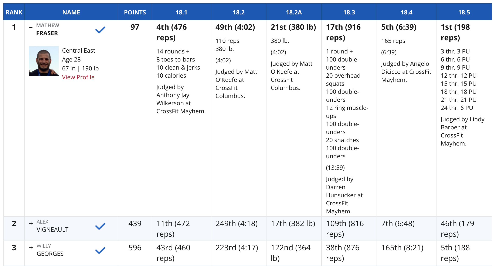
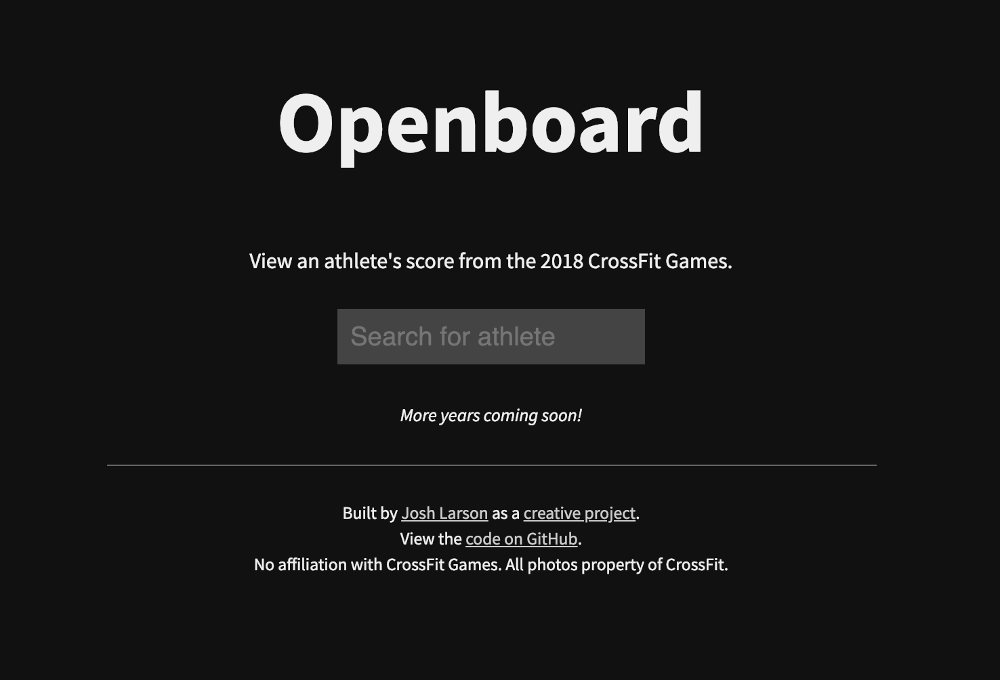
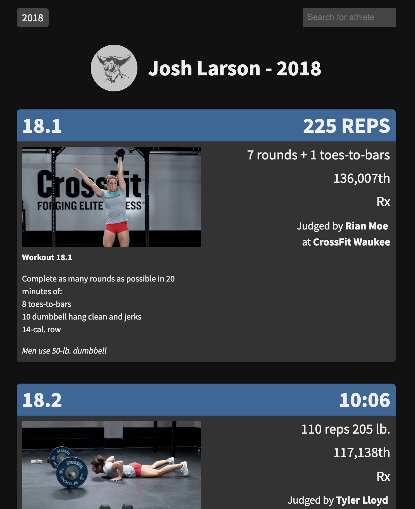

So there's this thing called the [CrossFit Games](https://games.crossfit.com/). Specifically, an event under that umbrella exists called the CrossFit Open.

Hundreds of thousands of people from around the world participate in the same series of five workouts during the month of February and March. It's all in affiliation with their local CrossFit gym.

Each athlete's stats gets logged by a certain date. There is a global leaderboard of athletes competing in the games.



_In case you were wondering, I clock in at about 130,000th place — too far down to show in this screenshot._

The leaderboard on the official website leaves a bit to be desired. Specifically:

- I can see my stats by searching for my name within my division, but I have to scroll through 50 other entries
- The expandable table interface is a bit limited and tough to consume
- I don't have a reference for the corresponding workout - only my score for that workout. It's tough to remember which workout was which each year!

## Doing my own thing

I noticed that the official leaderboard was powered by a JSON API. _Sick_. I saw this as an opportunity to build my own thing.

The goal was **to combine an athlete's performance with details from the workout**.

I'm calling it: [**Openboard**](https://openboard.now.sh).



And guess what: I streamed most of it live on the Internet!

## Part 1: The bones

<iframe width="560" height="315" src="https://www.youtube.com/embed/HRcuIEUXo7c" frameborder="0" allow="accelerometer; autoplay; encrypted-media; gyroscope; picture-in-picture" allowfullscreen></iframe>

My strategy for starting the app was:

1. I knew I wanted to deploy the site on [Zeit Now](https://zeit.co/now). They're a really cool, modern serverless hosting company.
1. I wanted to get better at React, as well as learn [Next.js](https://nextjs.org), which is a server-side rendered version of React (also created by Zeit)

To start, I copied some static, stubbed JSON data and extracted it into functions like `fetchAthletePerformance()`. This allowed by to quickly iterate over some sample data without having to make real network requests. It also made it simple to swap in a real JSON endpoint when I was ready to go live.

The video above involves me parsing through this sample JSON data and figuring out how to piece important details together like **workout name**, **workout variation for a division**, and **loading metadata**.

I was happy to get as much done in one hour as I had. The end result wasn't pretty, design-wise — so my next chunk of work was the _design_ part.

## Part 2: Let's put some makeup on this thing

<iframe width="560" height="315" src="https://www.youtube.com/embed/o4XE0zVcc2U" frameborder="0" allow="accelerometer; autoplay; encrypted-media; gyroscope; picture-in-picture" allowfullscreen></iframe>

This was a struggle. I am admittedly _bad_ at design, but I'm trying to get better at it.

As I approached a strategy to building out the user interface for Openboard, I ended up going with [styled-jsx](https://github.com/zeit/styled-jsx) for a CSS-in-JS framework. While I've used [styled-components](https://www.styled-components.com/) in the past, styled-jsx was built into Next.js out of the box (because, well... Zeit).

This felt a little weird!

```jsx
<style jsx>{`
  .nav-bar {
    display: flex;
    justify-content: space-between;
  }
`}</style>
```

But after a while, it felt like I was writing normal CSS. I only encountered a couple weird things, mainly related to attempting to style nested child elements generated by third-party components (like [React Autocomplete](https://github.com/reactjs/react-autocomplete/)). In that case, I stuck on the `global` attribute and used some descendant logic accordingly.

At this point, I also [deployed this baby](https://openboard-bwhy2zhlt.now.sh/athlete?id=1234) for the first time! It was a real breeze, using Zeit's official [Next.js example](https://zeit.co/examples/nextjs/).

I really dig the concept of [immutable deployments](https://zeit.co/docs/v2/deployments/concepts/immutability/). It allows you to ship a unique version of your project at unique url, like https://openboard-bwhy2zhlt.now.sh/athlete?id=1234. It's immutable, meaning it's stuck like that forever in time. No need to modify anything - just ship a new version. When it's ready, I run `now alias` (or just let [GitHub auto-deployments](https://zeit.co/docs/v2/integrations/now-for-github/) take care of that when merging into master).

## Part 3: Dark mode and fine-tuning

<iframe width="560" height="315" src="https://www.youtube.com/embed/Qsycj8fIcKA" frameborder="0" allow="accelerometer; autoplay; encrypted-media; gyroscope; picture-in-picture" allowfullscreen></iframe>

To be honest, migrating to a dark theme was easier than I thought. I'm not sure if it's _actually a better design_, but I'll take it.



It was really fun building a year navigation component and integrating directly with [routing support in Next.js](https://nextjs.org/docs/#routing). Sadly, I ended up disabling this feature because — wouldn't you know it — I discovered **the CrossFit API results and structured inconsistently year-to-year**.

This is not surprising. Honestly, I'm just glad the results are available via a modern API and not locked down in weird HTML views and Java applets.

As I built this last part, I hit a few bumps in the road.

Between Saturday and Sunday, [TypeScript support was broken](https://github.com/zeit/ncc/pull/233) due to a merge in a package used by the Now builder. I used TypeScript for my proxy server to fetch and return API requests.


But this wasn't a huge deal - I was able to lock to a previous version and get going again.

Another thing I ran into was trying to determine whether I was in a local environment so I could route proxy API requests accordingly (to my development server or to the production server). I tried to use `publicRuntimeConfig` config variables, but that led to A) successful deploys but B) a broken website with vague error messages in the logs.

Thankfully, [this support thread](https://spectrum.chat/?t=3109716c-2a00-4aec-86cc-2b44b65768be&m=MTU0NzU5NzAxMDQ5Mg==) made it clear that — indeed — plugins or other config options are not yet supported using the `serverless` mode for Next.js. I should have checked the Github docs for the canary version of Next.js for more information instead of the [Next.js Production Deployment docs](https://nextjs.org/docs/#production-deployment).

I'm also pretty sure I never got the `publicRuntimeConfig` to work _locally_ in the browser-executed scripts, either - which kind of defeats the purpose.

I ended up hardcoding the routes to point to production, because I wanted to share it with people 😀.

Honestly, I am blown away by how slick the Next.js framework is and by how easy it is to deploy to Zeit Now. The hiccups along the way are just the price you pay for using bleeding-edge technology.

**Visit Openboard at https://openboard.now.sh! Search 'josh larson', or view my stats page here: https://openboard.now.sh/athlete?id=1005789**
